  

  
  
  
  
  
  
  
  
  

---

## Hey

I'm **Berkay**, 18, from **Tokat, Türkiye**. I write **Go, Node.js, Rust and Python** and I
pick whichever one the problem actually wants — a background daemon gets Rust, an
edge API gets JavaScript, a data pipeline gets Python.

There is one habit running through most of what I build: **I'd rather speak the
protocol than drive a browser.** Headless Chrome is 300 MB of dependency to press a
button that is really just an HTTP request. So I read the traffic, work out what the
server actually wants, and send that. The result is smaller, faster, and it doesn't
break when someone moves a CSS class.

That approach is the reason `aterkeep` fits in a 2.3 MB binary with no runtime at all.

---

## Things I've built

<!--projects-->
<table>
<tr>
<td width="50%" valign="top">

### 🦀 [aterkeep](https://github.com/KaramelliS/aterkeep)
`Rust` · `axum` · `tokio` — ⭐ 7

A self-hosted manager that keeps a free Aternos Minecraft
server online 24/7. One ~2.3 MB binary: keep-alive loop,
embedded web panel in **14 languages**, live console,
anti-idle Minecraft bot, AES-256-GCM encrypted session.

**Hardest part:** the queue. Aternos opens a ~30 second
window when your turn comes and sends you to the back if
nobody answers — which is why plain keep-alive scripts wait
forever. This one answers it.

*Pure HTTP. No Selenium, no Puppeteer, no browser.*

started 09 Aug 2026 · last push 12 Aug 2026

</td>
<td width="50%" valign="top">

### 🔗 [shortlink-bypass](https://github.com/KaramelliS/shortlink-bypass)
`Python` · `curl` — ⭐ 1 · MIT

Resolves link-gateway services — linkvertise, adf.ly,
cpmlink, boost.ink, aylink — straight to the destination.
**1240+ validated redirect followers.**

No browser and no ad rendering: each gateway is a
reverse-engineered redirect chain, so it runs in
milliseconds where a headless browser needs seconds.

Packaged with `pyproject.toml`, a one-line `install.sh`
and GitHub Actions CI. Dead services get retired to
`shorteners_inactive.txt` rather than silently failing.

started 30 Jun 2026 · last push 03 Jul 2026

</td>
</tr>
<tr>
<td width="50%" valign="top">

### 📬 [cloudflare-temp-sms](https://github.com/KaramelliS/cloudflare-temp-sms)
`Node.js` · `Fastify` · `Redis` — MIT

Turns **Cloudflare Email Routing** into a zero-config
disposable **temp-mail API**. Create an inbox, receive mail
by webhook, everything expires on a Redis TTL.

Rate limiting and CORS are built in rather than bolted on,
and it ships with Docker, Railway and Render configs — so
deploying it is one command wherever you like.

started 20 Jul 2026 · last push 20 Jul 2026

</td>
<td width="50%" valign="top">

### 🗯️ [comic-translator](https://github.com/KaramelliS/comic-translator)
`Python` · `OpenCV` · `EasyOCR` · `Streamlit`

A full comic/manga translation pipeline: **speech-bubble
detection → OCR → translation → text re-rendering** back
into the original bubble, with a Streamlit UI on top.

The interesting problem isn't the translating, it's putting
the new text back so the page still looks drawn, not pasted.

started 30 Jun 2026 · last push 30 Jun 2026

</td>
</tr>
<tr>
<td width="50%" valign="top">

### 🎯 [valorant-fandom](https://github.com/KaramelliS/valorant-fandom)
`HTML` · `Python` · `JavaScript`

Valorant wiki data as a **serverless JS library** — agents,
weapons, maps, ranks and skins across 5 modules, served
directly from GitHub raw URLs.

Scraped once with Python, shipped as static JSON. No API
key, no backend, no rate limit.

started 10 Jul 2026 · last push 11 Jul 2026

</td>
<td width="50%" valign="top">

### 🤖 [agent-setup](https://github.com/KaramelliS/agent-setup)
`docs`

Cross-OS setup memory for coding agents — OpenCode, Claude
Code and Codex — so a Windows, Linux and macOS machine can
each log what they configured and stay in sync.

Notes rather than a program, but it saves me an afternoon
every time I set up a new box.

started 19 Jul 2026 · last push 20 Jul 2026

</td>
</tr>
<tr>
<td width="50%" valign="top">

### 📦 [auto-ominous](https://github.com/KaramelliS/auto-ominous)
`Java` · `fabric` · `fabricmc` · `minecraft` — ⭐ 1 · MIT

One key drinks an Ominous Bottle from anywhere in your inventory and puts your hotbar back. Fabric, Minecraft 1.21.1 to 1.21.11.

started 11 Aug 2026 · last push 11 Aug 2026

</td>
<td width="50%"></td>
</tr>
</table>
<!--/projects-->

---

  

  

  

  

  
    Every number above — and every project card — is read from the GitHub API and
    rebuilt by <a href="scripts/build.py"><code>scripts/build.py</code></a>, running
    <a href=".github/workflows/refresh.yml">in GitHub Actions</a> on a schedule and on
    every push. No third-party badge service, nothing hand-typed. Ship a new repository
    and it appears here on its own.
  

---

## What I'm on now

- Turning **aterkeep** into a finished product — 14 languages, installers for three
  platforms, a design system, and a promo video per language
- More **Go** — nothing public in it yet, but that's where a lot of my reading goes
- Whatever catches my attention next. I'm 18 and I'd rather stay curious than
  specialise too early

<b>🇹🇷 Türkçe</b>

 

Merhaba, ben **Berkay**. 18 yaşındayım, **Tokat**'ta yaşıyorum. **Go, Node.js, Rust ve
Python** yazıyorum ve problem hangisini istiyorsa onu kullanıyorum.

Yaptığım işlerin çoğunda ortak bir alışkanlık var: **tarayıcı sürmektense protokolü
kendim konuşmayı tercih ediyorum.** Aslında tek bir HTTP isteğinden ibaret olan bir
düğmeye basmak için 300 MB'lık headless Chrome taşımanın anlamı yok. Trafiği okuyup
sunucunun gerçekte ne istediğini çıkarıyorum ve onu gönderiyorum. Sonuç daha küçük,
daha hızlı oluyor ve biri bir CSS sınıfının adını değiştirdiğinde bozulmuyor.

`aterkeep`'in hiçbir runtime'a ihtiyaç duymadan 2.3 MB'lık tek bir binary'ye sığmasının
sebebi bu.

## Reach me

  
  

  Open to interesting problems — especially anything involving a protocol nobody documented.

  Built in the open · <a href="https://github.com/KaramelliS?tab=repositories">all repositories →</a>

<!-- profile -->
